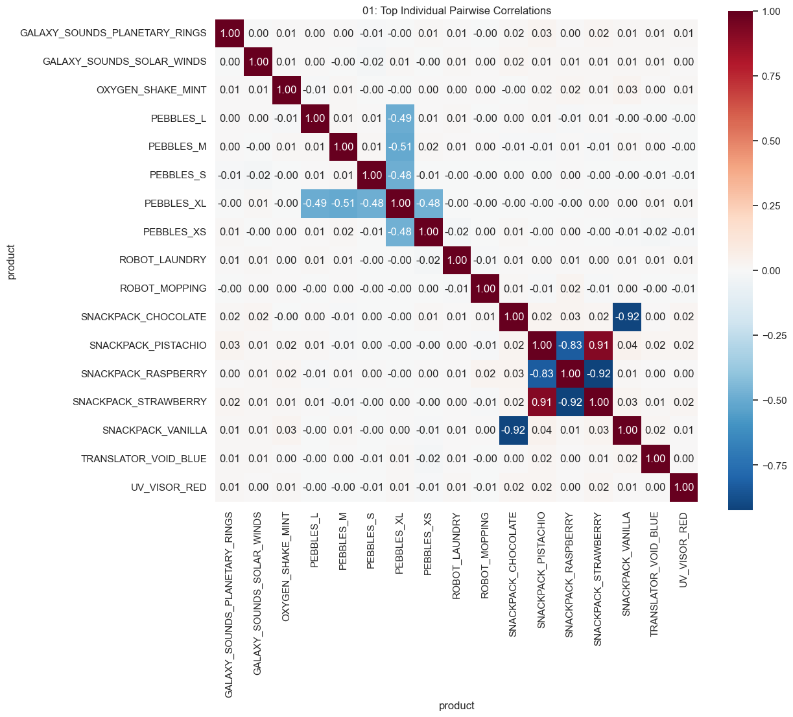
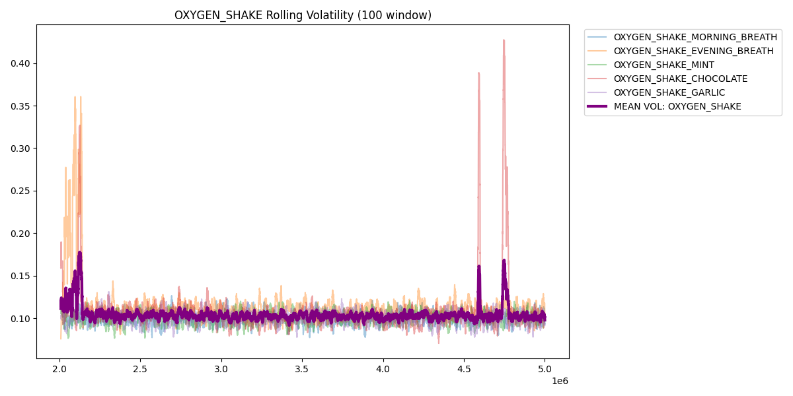
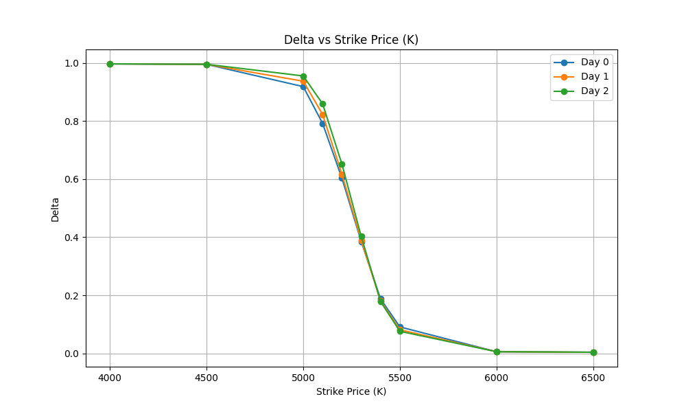

# Prosperity-4
- Market making, Relative vol trading, Trader IDs (Mark 38), EDA, Only vibe-coded visualisations  
- Learned (specfic to this comp): Importance of EDA vs assuming their DGP, the "right" way is not the "best" way, and the speed vs quality+understanding trade-off from vibe-coding is worth given the 2 day deadlines and favoured quantity>quality

